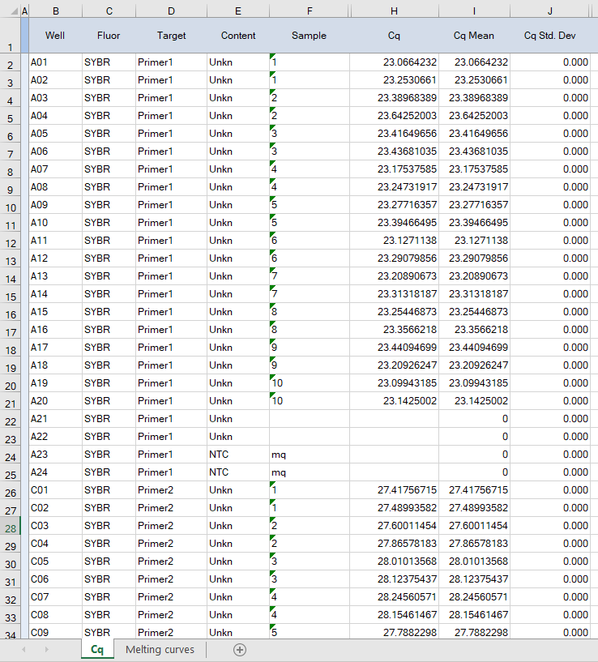
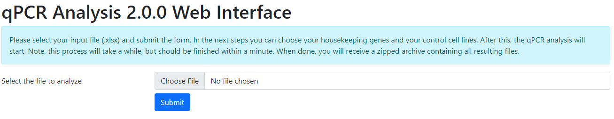

# qPCR-analysis

The qPCR analysis software is designed to conveniently and intuitively plot
 amplification plots and melting curves.
In addition, it automates the calculation of the relative gene expression,
 calculates the efficiency of every primerset used,
 and plots this data in a clear way.
The software is written in Python, can be run using the command line,
 but also includes a web interface.
The web interface is also publicly available at
 https://humgen.nl/scripts/qPCR-analysis/. 

As input, both the LightCycler 480 and Bio-Rad systems are suitable,
 but these require different preparation of the Excel files.


## Table of contents
- [Installation](#installation)  
  - [Web interface](#web-interface)
    - [Maintenance of the web interface](#maintenance-of-the-web-interface)
- [How to use qPCR-analysis](#how-to-use-qpcr-analysis)
  - [Preparing the LightCycler 480 output](#preparing-the-lightcycler-480-output)
  - [Preparing the Bio-Rad output](#preparing-the-bio-rad-output)
  - [The qPCR analysis](#the-qpcr-analysis)
    - [Through the terminal](#through-the-terminal)
    - [Using the web interface](#using-the-web-interface)
- [Structure of the output](#structure-of-the-output) 
  - [The "Data" directory](#the-data-directory)
  - [The "Figures" directory](#the-figures-directory)
  - [The "Input" directory](#the-input-directory)


## Installation

qPCR-analysis has been developed with, and tested on, various versions of Python
 and the required libraries.
Other versions might work, but are not supported.
qPCR-analysis has the following requirements:
- Python (3.6.13 – 3.10.6)
- matplotlib (3.0.2 – 3.5.1)
- natsort (6.0.0 – 8.2.0)
- pandas (0.23.0 – 1.3.5)


### Web interface

qPCR analysis can also be operated from a web browser.
A PHP-based web interface is included in the `web-wrapper` directory.
To enable this interface, install a webserver such as Apache, enable the PHP
 module, and add this project to a location where the webserver can reach it.
Make sure the `web-wrapper/data` directory is writable by the webserver user.

If you are not using an Apache webserver, make sure you protect the
 data directory from direct downloads, to ensure the safety of the data.
For Apache users, a `.htaccess` file is already in place to block access.

The web interface has been developed with, and tested on Apache 2.4.38 – 2.4.52
 and PHP 7.3.31 – 8.1.2.


#### Maintenance of the web interface

For every analysis, a new directory is created
 in the `web-wrapper/data` directory.
To avoid filling up your drive, make sure old data folders are removed.
You can use the cronjob below for this purpose.
Make sure the cron will run as the user of the webserver,
 and that you replace `path` with the appropriate directory.

```
0 0 * * * find /path/data/ -type d -iname 1\* -mtime +0 | xargs rm -r
```

This removes data folders older than 24 hours, every night at midnight.
Feel free to change the settings; this cron can easily be run at any given time,
 run more than once a day, or less frequently, e.g., once a week or month.
If you want the cronjob to create output, add a "v" at the end of the command,
 i.e., `xargs rm -rv`.


## How to use qPCR-analysis

The full workflow of using qPCR-analysis depends on your input.


### Preparing the LightCycler 480 output

Before using the qPCR-analysis software,
 the data coming out of the LightCycler 480 needs to be transposed.
For this, you can use the http://humgen.nl/scripts/transpose/ website,
 and use the 'qPCR manual' written before.
#### TODO: Manual should be included on the Transpose website, or copied here.
After copying the result from the transpose process to Excel, remove the data
 from empty wells (wells of the plate where you did not pipet anything in).
Name this sheet "Data".
Name every sample as follows: "cell_primer" (e.g., "Control1_GAPDH").


Continue following the steps from the manual,
 using the "Determine Baselines" function in LinRegPCR.
#### TODO: Copy the steps from the manual here, or choose to simply refer to it.
This will create two new sheets; "Data_output" and "Data_compact".
Do not change the names of these sheets,
 or any of the column names within these sheets.


If you exported melting curves from the LightCycler 480, copy the content
 of the .txt file to your Excel file in a new sheet named "Melting curves".
Delete the columns (both X and Sample) of empty wells.


From here, continue with [the qPCR analysis](#the-qpcr-analysis).


### Preparing the Bio-Rad output

Before using the qPCR-analysis software,
 the Bio-Rad data need to be prepared a bit.
Firstly, rename the sheet containing the Cq values to "Cq".
In the column "Sample", name the samples containing the mq control "mq" or "MQ".
If you exported melting curves, copy the content to a new sheet
 in the Excel file that you are going to analyze.
Name this sheet "Melting curves".



 

From here, continue with [the qPCR analysis](#the-qpcr-analysis).


### The qPCR analysis

#### Through the terminal

If you'd like to have a list of primers and samples listed in your input file,
 you can ask qPCR-analysis to extract this data by running:

```
python3 qpcr_analysis.py --input <input file>
```

When invoked without any further arguments, qPCR-analysis will read out your
 spreadsheet and generate `Input/Genes.txt` and `Input/Cell_lines.txt` in the
 current directory.
These files, respectively, contain the list of primers and samples mentioned in
 your given spreadsheet.
Values from these lists can then be used for the `--genes` and `--controls`
 arguments to process your spreadsheet.

You can invoke qPCR-analysis by running:

```
python3 qpcr_analysis.py --input <input file> \
                         --genes <gene> [<gene> [...]] \
                         --controls <control> [<control> [...]] 
```

This will create three directories in the current directory;
 `Data`, `Figures`, and `Input`.
The qPCR analysis software should take a little less
 than a minute to process your data.
For a detailed description of the output files,
 see [structure of the output](#structure-of-the-output).


#### Using the web interface

The web interface is designed to work as intuitively as possible.
An example installation is currently available at
 [HumGen.nl/scripts/qPCR-analysis](https://humgen.nl/scripts/qPCR-analysis/).
The web interface does not require any log in, but simply asks you
 to upload the `.xlsx` input file that you prepared.



After pressing the submit button, the interface runs the qPCR-analysis script to
 extract the list of primers and samples, and then lets you choose the
 housekeeping genes and the controls cell lines.
In each case, the interface shows buttons for each possible value.
Clicking the buttons you'd like to choose, selects them.
For each, you must select at least one value.
Then, press the submit button to continue.
After selecting both at least one housekeeping gene and then at least one
 control sample, the script will take a while to execute - please wait for it
 to finish execution.
Your results will be ready and downloaded within a minute.
If any failures occur, clear error messages will indicate at what point the
 script failed to run, so that actions can be taken to fix these.


## Structure of the output

qPCR-analysis creates three folders; `Data`, `Figures`, and `Input`.


#### The "Data" directory

The `Data` folder contains Excel sheets that you can use
 to make figures for yourself, if needed.
- `Average_Ct_values.xlsx` — the average Ct per condition
- `Relative_expression_values.xlsx` — the relative gene expression per condition


#### The "Figures" directory

The `Figures` folder contains figures generated by the script:
- `Average_Ct_bargraph.pdf` — triplicate average Ct value of each sample
- `Melting_curves_sorted.pdf` — graphs showing melting curve per sample
- `Primer_efficiency.pdf` — efficiency of the primersets *(LightCycler only)*
- `qPCR_plots_sorted.pdf` — amplification plots *(LightCycler only)*
- `Relative_expression_values.pdf` — relative expression values of each sample

The melting curves and amplification plots are sorted in a way that every
 row is a cell line, and every column a gene.
This makes it easy to compare cell lines and see which samples are different.


Other figures include bargraphs showing the triplicate average
Ct value of each sample, the relative expression values of each sample,
 and, in case LightCycler data was used, the efficiency of the primersets.
Control lines are represented by gray bars, other lines by blue bars.


#### The "Input" directory

The `Input` folder contains the following files:
- `Cell_lines.txt` — a list of extracted cell lines, optional
- `Genes.txt` — a list of extracted housekeeping genes, optional
- `input.xlsx` — your input file *(web interface only)*
- `settings.json` — a structured text file containing the settings
   with which the web interface was run

[comment]: # (pandoc README.md -f gfm -V geometry:a4paper -V geometry:margin=2cm -V fontsize=12pt -V mainfont="Myriad Pro Light" --pdf-engine=xelatex -o README.pdf)
